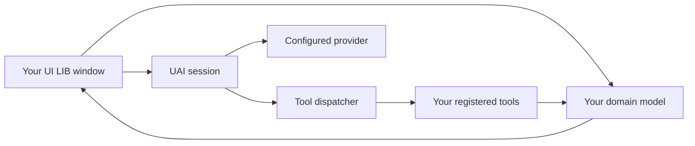

# Embedding Project UAI

Build a script interface with Project UAI UI LIB, add UAI to a host script, or
connect your own library window to UAI's conversations and tools. This guide
documents **embedding SDK 1.0.0** in **Project UAI 2.5.0**, alongside **UI LIB
1.2.1**. SDK metadata is exposed through `uai.sdk`; UI LIB remains a separate
bundle with its own version and lifetime.

Start with [the complete workbench example](../examples/embedding/README.md) for
working code. Use [the UI library reference](UI_LIBRARY.md) for every control,
window option, configuration method, and cleanup method. This document explains
how those pieces fit into an application, including the runtime APIs that the
standalone UI library does not provide.

- [Choose an integration](#choose-an-integration)
- [Hosts and prerequisites](#hosts-and-prerequisites)
- [Load and reuse the bundles](#load-and-reuse-the-bundles)
- [Host context](#host-context)
- [Client handle](#client-handle)
- [SDK quickstart](#sdk-quickstart)
- [Conversations](#conversations)
- [Requests](#requests)
- [Events and rendering](#events-and-rendering)
- [Custom tools](#custom-tools)
- [Permissions and tool scope](#permissions-and-tool-scope)
- [Hooks](#hooks)
- [Providers and client configuration](#providers-and-client-configuration)
- [Build your own UI](#build-your-own-ui)
- [Files and bridge images](#files-and-bridge-images)
- [Ownership and shutdown](#ownership-and-shutdown)
- [Repository extensions](#repository-extensions)
- [Distribution and verification](#distribution-and-verification)
- [Troubleshooting](#troubleshooting)

## Choose an integration

| Goal | Load | Your code owns | UAI owns |
| --- | --- | --- | --- |
| A settings panel, player picker, or script workbench | `dist/uai-ui.lua` | Domain state, callbacks, subscriptions | Window, controls, layout, input, motion, cleanup scope |
| Add the normal assistant to an existing host script | `dist/uai.lua` | Host context and optional custom tools | Standard app, sessions, provider transport, permissions, persistence |
| Use the agent without mounting its app | `dist/uai.lua` with `{ ui = false, reuse = true }` | Request handling, integration scope, approval presentation when needed | Sessions, tools, provider transport, permissions, persistence |
| A focused custom assistant panel | Both bundles | Declarative view, draft state, mapping events to controls | Agent turns, tools, retained conversation, standard permission and provider UI |
| A new reusable control or layout capability | Repository sources | Implementation and its public API | Build, shared conventions, distribution |
| A browser interface | Existing web bridge and its protocol | Browser view and bridge integration | Connected Roblox runtime and relay contracts |

Loading UI LIB alone does not start an agent, create a conversation, contact a
model provider, or mount a window. `UI:CreateWindow` mounts the window.

Loading the full client normally mounts the established UAI application. Pass
`ui = false` to start the runtime without constructing that application. The
first explicit `uai.show(...)`, `uai.toggle()`, or `uai.openSession(id)` mounts it.
`uai.hide()` only hides an already mounted app. The loader has no alternate client
`Parent` option. A session's `headless` flag separately controls transcript
retention; most SDK integrations should leave it false.

For new script interfaces, use UI LIB's tabs, sections, controls, and lifecycle
methods. The existing application in `src/ui` is a separate interface. Adding
your own panel does not require replacing it.



Both a manual button and an agent tool can call the same domain operation.
Keep that operation independent of controls: closing the window should not make
an agent-held tool reference point at a destroyed TextBox.

## Hosts and prerequisites

| Host | UI LIB | Full UAI |
| --- | --- | --- |
| Roblox client with executor HTTP and `loadstring` | Load the published bundle | Normal supported loader path; features depend on detected capabilities |
| Roblox Studio LocalScript with a checked-in ModuleScript | Require the UI bundle locally | The remote executor loader is not a normal LocalScript setup; use a deliberate repository integration for runtime/network changes |
| LuaJIT offline harness | Behavioral examples with Roblox mocks | Runtime and scenario verification with mocked services/providers |
| Web browser | Cannot execute the Roblox Lua bundle | Connect through the web bridge; see [bridge documentation](../bridge/README.md) |

For an executor loader, the host must supply the HTTP and compilation functions
used by that loader. A failed download or compile should be reported. Falling
back to another UI library changes the interface and lifecycle contract.

The full client detects optional executor capabilities through `uai.caps`.
Unavailable tools are omitted from provider tool definitions. File persistence,
clipboard access, native hooks, arbitrary execution, and local endpoint access
are not universally available. A table passed as context cannot grant them.

The UI library can render without executor file access. Its JSON import/export
works through Roblox HttpService; `SaveConfig` and `LoadConfig` need file
functions. Local profile information comes from Roblox. Navigation and action
labels are text-only, the library draws its own brand mark and window-control
glyphs, and the `Project UAI | UI LIB.` attribution stays in every window,
restore launcher, and dialog.

## Load and reuse the bundles

### Minimal loaders

Standalone UI:

```lua
local UI = loadstring(game:HttpGet(
	"https://raw.githubusercontent.com/Project-Ptolemy/ProjectUAI/main/dist/uai-ui.lua"
))()
local window = UI:CreateWindow({ Id = "my-tool", Title = "My tool" })
```

Full client with host context:

```lua
local uai = loadstring(game:HttpGet(
	"https://raw.githubusercontent.com/Project-Ptolemy/ProjectUAI/main/dist/uai.lua"
))({
	prompt = "This host provides workbench_status and workbench_configure for local workbench settings.",
})
assert(uai and uai.alive, "UAI did not start; inspect the console error")
```

These short snippets assume successful HTTP and compilation. The
[launcher](../examples/embedding/launcher.lua) supplies explicit download,
compile, and startup checks for a complete example.

### Reuse without toggling

Pass `reuse = true` to return a running copy of the same build without toggling
its app. This also supports a UI-free first boot:

```lua
local source = game:HttpGet(
	"https://raw.githubusercontent.com/Project-Ptolemy/ProjectUAI/main/dist/uai.lua"
)
local chunk, why = loadstring(source)
assert(chunk, why)
local uai = chunk({ ui = false, reuse = true, prompt = "Help with this host's workbench." })
assert(uai and uai.alive, "A live UAI client is required")
```

Keep the returned handle; a host that has it can reuse it without another
download. The optional global `getgenv().UAI` is available only where `getgenv`
exists. Reusing a client preserves that client's provider settings,
permissions, tools, and boot context. Register your integration against the
returned live handle; do not assume a new context was applied. In particular,
`ui = false` does not unmount an existing app.

### Loader reruns and changed builds

| Situation | Loader behavior |
| --- | --- |
| Same live build | Returns the existing handle and toggles the app, unless `reuse = true`; does not adopt a new context table |
| Different build, safe replacement | Preserves state, unloads the old client, boots the new one |
| Different build, active or unsaved work | Keeps the old handle and reports what blocks replacement |
| Previous cleanup did not finish | Keeps the blocked handle and reports that a rejoin is needed |
| Bootstrap failure | Reports the startup error and returns nil |

Replacement checks include active sessions/workspace work, drafts and
attachments, isolated conversations, and successful persistence. Treat the
returned `alive`, `version`, and `build` as authoritative. Downloading new source
does not prove that a new build replaced the running one.

### Pin one revision

`main` follows published updates. For a reproducible host release, replace
`main` with a reviewed commit SHA in **all** runtime, UI library, and example
module URLs. Store that revision once in your loader. The workbench launcher
demonstrates this arrangement.

The UI manifest at `dist/uai-ui.manifest.json` includes the library version,
bundle byte count, SHA-256, and source-module hashes. The client has its own
`dist/uai.manifest.json`. A manifest is a distribution record; the example
loader does not perform automatic signature or hash verification.

### Use UI LIB from Studio

Copy the contents of `dist/uai-ui.lua` into a ModuleScript named `UAIUI` under
ReplicatedStorage. Require it from a LocalScript:

```lua
local players = game:GetService("Players")
local storage = game:GetService("ReplicatedStorage")
local UI = require(storage:WaitForChild("UAIUI"))
local window = UI:CreateWindow({
	Id = "studio-workbench",
	Title = "Workbench",
	Parent = players.LocalPlayer:WaitForChild("PlayerGui"),
	ToggleKey = false,
})
window:Tab({ Id = "main", Title = "Main" }):Section({ Title = "Status" }):Label({
	Id = "ready", Text = "Ready for your application callbacks",
})
```

No runtime HTTP or `loadstring` is needed for this local UI bundle. Your game
still owns client/server authority and RemoteEvent validation. UI callbacks are
client code; a control cannot grant server permissions.

## Host context

The full bundle is a chunk called with an optional table. `init.lua` chooses:

1. The explicitly supplied table, if the argument is a table.
2. Otherwise `getgenv().UAI_CONTEXT`, if available and a table.
3. Otherwise a new empty table.

The chosen table is available as `uai.env.context`. It is not deep-copied.
Recognized integration fields are:

| Field | Consumer | Meaning |
| --- | --- | --- |
| `prompt` | `agent/prompt` | Extra host instructions included when assembling prompts |
| `hooks` | `agent/hooks` at boot | Map of hook kind to function; adopted once during startup |
| `ui = false` | Bootstrap | Skip initial application mount; explicit navigation can mount it later |
| `reuse = true` | Bootstrap | Return a live same-build client without toggling its app |
| `gravity` | Runtime Gravity adapter | Optional host fallback for the existing Gravity integration |
| Your own namespaced fields | Your code | Shared host objects or configuration; no automatic interpretation |

`context.tools`, `context.providers`, `context.theme`, `context.Parent`, and
`context.headless` are not automatic registration or boot options. Register tools
through `uai.tools.register`, manage providers through `uai.providers`, and give
window options to `UI:CreateWindow`.

The workbench example stores its model at
`uai.env.context.workbenchExample`. That is an example-owned namespace, not a
UAI feature. Choose a distinct namespace for your own integration. Prompt text
describes capabilities; it does not enforce access or register a tool.

Changing the `hooks` table after boot does not register new handlers. Use
`uai.hooks.register(...)` or an SDK scope's `hook(...)` method.

## Client handle

UAI runtime methods use **dot calls**. UI LIB object methods use **colon calls**.
For example, `uai.show("chat")`, `session.send("Hello")`, and
`window:SetTitle("Workbench")` are correct. `uai:ask("Hello")` passes an unwanted
self argument. Signals use `signal:connect(...)`, with a lowercase `connect`.

| Handle member | Purpose |
| --- | --- |
| `alive`, `version`, `build`, `uiMounted` | Runtime lifetime, identity, and whether the standard app is mounted |
| `sdk` | Versioned requests, integration scopes, and feature discovery |
| `ask(text)` | Calls `sessions.current().send(text)`; returns acceptance, not the response |
| `show(panel)` | Shows the standard application, optionally selecting a panel |
| `openSession(id)` | Selects a registered conversation and opens it in the standard application |
| `hide()`, `toggle()` | Controls standard application visibility |
| `destroy()`, `unload()` | Full client shutdown; unload is an alias |
| `sessions` | Session manager described below |
| `tools` | Agent tool registry and dispatcher |
| `hooks`, `permissions` | Public hook registration and client-wide permission services |
| `providers` | Provider records and selection |
| `config` | Client configuration access and persistence |
| `caps`, `log`, `bridge` | Detected capabilities, diagnostic logging, bridge runtime |
| `env` | Factory-module environment and `env.require(id)` |
| `app` | Established application controller, absent before mounting |

Common navigation calls are `uai.show("chat")`, `uai.show("providers")`, and
`uai.show("logs")`. To align the native chat view with a registered conversation,
call `uai.openSession(session.id)`. A UI-free host can inspect `uiMounted` before
offering navigation. Once mounted, hiding the app does not reset that flag.

The SDK version describes the documented `uai.sdk` methods and their lifecycle
contract. Feature availability is separate from executor capabilities in `caps`
and from provider/model support. `env` and `app` expose implementation services;
pin your revision when using deeper methods. Do not overwrite `env.require`,
`env.loadedModules`, session internals, or provider modules to inject behavior;
use hooks, tool registration, and the public methods described here.

## SDK quickstart

Load a UI-free client as shown above, then create an owned integration and a
named conversation. This example assumes a provider and real model have already
been configured; the SDK does not guess either:

```lua
assert(uai.sdk and uai.sdk.features.requests and uai.sdk.features.resourceScopes,
	"This host requires SDK requests and resource scopes")
local scope, scopeError = uai.sdk.createScope("myhost")
assert(scope, scopeError)
local session, sessionError = uai.sessions.open("myhost-assistant", {
	title = "Host assistant", ephemeral = true,
	toolFilter = {}, -- No agent tools are needed for this example.
})
if not session then scope.destroy(); error(sessionError) end

local request, reason = uai.sdk.request(session, "Explain how this host uses a dedicated conversation.", {
	onComplete = function(result)
		if result.ok then print(result.text) else warn(result.error or result.status) end
	end,
})
if request then
	scope.give(function() request.cancel() end)
else
	warn("Request was not accepted: " .. tostring(reason))
end
-- Call scope.destroy() when this host integration ends.
```

Use [sdk.lua](../examples/embedding/sdk.lua) for a complete executable entry
point with checked downloads, a read-only host tool, events, explicit requests,
and teardown. [Requests](#requests) documents results and cancellation;
[Ownership and shutdown](#ownership-and-shutdown) defines scopes. Provider
settings and permissions are shared by every integration using this client.

## Conversations

### Choose who owns the conversation

```lua
local current = uai.sessions.current()
local dedicated, created = uai.sessions.open("myhost-workbench", { title = "Workbench assistant" })
assert(dedicated, created)
-- Opening a conversation in the manager does not mount or select the app.
-- uai.openSession(dedicated.id) opens its native view when desired.
```

`current()` returns the selected thread, creating one if needed. A custom panel
that captures this return value stays attached to that thread even when another
view changes the active conversation. This is useful for a dedicated workbench.
To follow selection instead, subscribe to `sessions.listChanged`, compare IDs,
detach the previous session listener, and rebuild your retained view.

`sessions.get(id)` returns the registered conversation or nil. `open(id, options)`
returns `session, created`, where `created` is true for a new conversation and
false for an existing one. It preserves current selection by default; pass
`activate = true` to select it. Existing conversations keep their options except
for that explicit activation choice. Check the returned session's filters when
reusing a named conversation; new options do not replace an existing policy.

`newThread(options)` creates, registers, and activates a thread unless
`activate = false`. Let UAI generate the ID unless you have a defined identity
scheme. IDs accept 1–120 letters, digits, underscores, or hyphens. Invalid or
duplicate IDs return `nil, reason`; they never replace an existing conversation.
An ID already present in saved history is also reserved even when its thread is
not currently registered. `open` opens registered conversations or creates new
ones; it does not load arbitrary archived files by ID. Choose a different ID
when a saved, unregistered conversation already owns it.

`create(options)` only constructs a session. It does not register or activate it.
Untracked sessions are used by internal orchestration; they are not discoverable
through `list()` and will not open with `uai.openSession`. Use `open` or
`newThread` for ordinary host panels and SDK requests.

### Session options

| Option | Meaning |
| --- | --- |
| `title`, `id` | Initial title and optional unique identity |
| `folderId` | Optional destination from `sessions.folders()`; defaults to the recorded game; `universal` works across games |
| `activate` | `newThread` selects by default; `open` selects only when true |
| `ephemeral = true` | Exclude this conversation's history from ordinary persistence |
| `toolFilter` | Map of allowed tool names, for example `{ workbench_status = true }` |
| `toolGroups` | Map of allowed groups, for example `{ workbench = true }` |
| `toolExclude` | Map of excluded tool names |
| `maxTurns`, `budgetSeconds` | Per-session step/time choices used by the agent loop |
| `unlimited = true` | Per-session unlimited-work choice; does not remove transport/tool deadlines |
| `stream` | Optional request streaming preference |
| `headless = true` | Emits events but skips retained transcript and ordinary persistence |
| `depth` | Orchestration nesting level; normal host sessions leave it at zero |
| `placeId`, `placeName` | Optional place metadata; defaults come from the current place |

Filters are maps from nonblank string names to booleans, not arrays such as
`{ "workbench_status" }`. A missing map leaves that dimension unrestricted;
empty `toolFilter` or `toolGroups` maps allow no tools, while an empty
`toolExclude` excludes none. Filters combine with capabilities, global groups,
and permissions. Creation copies the supplied maps so later edits to an options
table do not change the conversation's policy.

Constructors reject invalid option types with `nil, reason`. Titles must be
strings; `activate`, `ephemeral`, `headless`, `unlimited`, and `stream` must be
booleans when supplied. `maxTurns` must be a positive finite integer,
`budgetSeconds` a positive finite number, and `depth` a nonnegative integer.
Validate host input before creating a conversation instead of relying on truthy
strings such as `"false"`.

`ephemeral = true` excludes new conversation JSON from persistence. On an existing
thread, `session.setEphemeral(true)` also deletes its saved JSON file. Neither
suppresses diagnostic logs, aggregate statistics, files written by tools, or
traffic sent to a provider. This is a conversation-storage choice, not a private
client or separate credentials.

### Persistence and restored policy

Ordinary saved conversations retain `toolFilter`, `toolGroups`, `toolExclude`,
`maxTurns`, `budgetSeconds`, `unlimited`, and `stream` in a versioned policy.
Restoring a valid saved policy keeps those restrictions and preferences.
Conversations with invalid policy data or an unsupported future policy version
are skipped during restore, with their original files retained.
Their saved IDs remain reserved, as do IDs for older history outside the active
restore/retention window, so a new host thread cannot overwrite those files.

Older saves without policy metadata restore with legacy defaults. In particular,
they do not recover tool restrictions that older clients never saved. Inspect
the returned session's filters before reusing a named conversation, especially
when `sessions.open` returns `created = false`; its supplied options do not
replace existing policy. Use a new dedicated conversation when the restored
policy does not match the integration's requirements.

### Send and finish

Conversation folders are independent of game context and tool policy.
`sessions.folders()` lists `{ id, label, kind, current, placeId? }` destinations;
`kind` is `game`, `universal`, or `custom`. `groups()` adds the conversations and
last activity, including empty custom folders and built-in destinations.
`folderLabel(sessionOrId)` resolves the current label.

`createFolder(name)` returns a folder or `nil, reason`. `renameFolder(id, name)`,
`removeFolder(id)`, and `moveToFolder(sessionOrId, folderId)` return `ok, reason`.
Only custom folders can be renamed or removed. Removal moves their conversations
to Universal without deleting messages. Names are unique ignoring ASCII case,
single-line UTF-8 of at most 120 bytes; at most 64 custom folders are retained.
Changes emit `sessions.listChanged`. Folder creation and edits verify persistence
when storage is available; failed writes do not publish the proposed change.
Older chats keep their game grouping, while missing custom memberships resolve
to Universal. Folder IDs are opaque; use the IDs returned by these APIs.

```lua
local session = uai.sessions.current()
local accepted, reason = session.send("Read the current workbench settings.", function(reply)
	-- The turn has released its busy state here.
	print(reply)
end)
if not accepted then
	warn("Request was not started: " .. tostring(reason))
end
```

`session.send(text, onDone?, files?, images?)` returns `true` when the request is
accepted, or `false, reason` when it is rejected. The callback receives the final
reply later. Acceptance does not mean that inference, a tool, or the overall
task succeeded. A callback reply may be failure text; use `error` and
`turn:end.failed` events when displaying outcomes.

One session runs one turn or compaction at a time. Up to eight native session
workers can be active across the client. `busy` covers the running worker;
`preparing` covers attachment preparation before acceptance. Preserve the draft
when a send is rejected. If preparation yields and the user edits again, clear
only the text that was actually submitted.

The standard loop can emit `status = "Ready"` and `turn:end` before `busy` is
released. Read `session.busy`, and refresh on `sessions.listChanged` or `onDone`
to re-enable Send. Treating a Ready event as final admission can leave a custom
button enabled too early or disabled indefinitely.

### Other session and manager methods

| Call | Result and behavior |
| --- | --- |
| `session.abort()` | Requests cooperative stop; returns whether something was stopped/requested |
| `session.aborted()` | Current cancellation/removal/runtime-stop state |
| `session.clear()` | Clears the conversation when idle; returns `false, reason` if busy, currently nil on success |
| `session.rename(title)` | Returns true or `false, reason`; trims and bounds the title |
| `session.compact(onDone)` | Returns acceptance; callback receives `(ok, summary)`; may use the configured summarizing provider |
| `session.setEphemeral(boolean)` | Sets isolation and returns the resulting boolean |
| `session.stats()` | Context statistics plus busy, turn, and todo information |
| `session.toolContext()` | Context for manual registry dispatch, including cancellation tied to this turn epoch |
| `sessions.list()` | Registered threads sorted by activity |
| `sessions.get(id)` | Looks up a live registered conversation; nil if absent |
| `sessions.open(id, options?)` | Returns `session, created` or `nil, reason`; preserves selection unless explicitly activated |
| `sessions.switch(id)` | Changes active ID; returns false if absent; use `uai.openSession` to align the native view |
| `sessions.busy()`, `sessions.busyCount()` | Busy registered sessions and their count |
| `sessions.persist(session)` | Attempts ordinary conversation persistence; not available for headless/ephemeral sessions |
| `sessions.remove(id)` | Stops/removes the registered conversation and deletes its saved history |

Stop does not immediately clear `busy`, cancel every native host call, or roll
back effects. Keep the status visible until the worker releases it. Do not set
`busy` or `abortFlag` yourself.

Closing a panel normally destroys the view only. `sessions.remove` is a
conversation-deletion action, not a way to unsubscribe from a conversation.

## Requests

Prefer `uai.sdk.request(session, text, options?)` when your host needs a structured
outcome. It accepts a live registered session and returns a request handle, or
`nil, reason` when admission fails. A busy/removed session, invalid input, and
failed attachment preparation are rejection cases. No completion callback runs
for a rejected request. Provider failures after acceptance settle the request
with a failure result instead.

```lua
local request, why = uai.sdk.request(session, "Read the workbench status.", {
	onEvent = function(event)
		if event.kind == "status" then print(event.text) end
	end,
	onComplete = function(result)
		print(result.status, result.text)
	end,
})
if not request then warn(why); return end

-- In a yieldable host task; timeout ends this wait, not the request.
local result, waitError = request.await(30)
if result then
	if not result.ok then warn(result.error or result.status) end
else
	warn(waitError)
	-- Keep observing the request, or call request.cancel() to request Stop.
end
```

| Request member | Contract |
| --- | --- |
| `status` | `running`, `succeeded`, `failed`, or `cancelled` |
| `result` | Nil until settled, then `{ ok, status, text, error?, sessionId }` |
| `cancel()` | Requests cooperative Stop for this request; cannot stop a later turn |
| `onComplete(callback)` | Returns an unsubscribe function or `nil, reason` for an invalid callback; settled requests deliver their result immediately |
| `await(timeoutSeconds?)` | Waits for a result; returns `nil, reason` on timeout or invalid timeout input |

Options are `onEvent`, `onComplete`, `files`, and `images`. Callbacks are protected
so host exceptions cannot break runtime settlement. `onEvent` receives this
request's session events while subscribed; use it for progress and presentation,
and use `onComplete` for the final outcome.
Callbacks can run before `sdk.request` returns; use their arguments instead of
assuming the variable receiving the returned handle has already been assigned.
`files` and `images` use the same
validated attachment references as `session.send`; see [Files and bridge
images](#files-and-bridge-images).

Unknown option keys and non-function callbacks are rejected. `await` must run
in a yieldable host task while the request is running. A timeout is a finite,
nonnegative number of seconds; `await(0)` polls without waiting. Omitting it waits
until settlement. A callback registered after settlement runs synchronously with
the existing result. Treat result tables as read-only shared values.

Every accepted request settles once. Ordinary completion waits until the session
releases its worker, so callbacks can begin a subsequent request. Success means
the agent turn completed without a terminal failure; it does not independently
verify that the model solved the host's domain task. Provider errors and exhausted
turn limits produce `failed`; Stop produces `cancelled`. Removing the conversation
or unloading the client settles outstanding requests as `cancelled` even when
the legacy `session.send` callback would not run.

`cancel()` does not instantly free a busy session: status remains `running` until
the worker finishes. Removal/unload can settle immediately while an underlying
host call still unwinds. Native operations already dispatched can retain effects.
Timeouts only stop `await`; use `cancel()` explicitly when the host wants to stop
the turn. Keep using `session.send` for existing integrations that expect its
boolean acceptance and text callback contract.

## Events and rendering

### Subscribe and replay

```lua
local releaseEvents = session.events:connect(function(event)
	if event.kind == "assistant:text" then
		print(event.text)
	elseif event.kind == "error" then
		warn(event.message)
	end
end)
window:Give(releaseEvents)
window:Give(uai.sessions.listChanged:connect(function()
	-- Refresh busy/removed/selection state for this panel.
end))
```

`session.events` is a per-conversation signal. `sessions.anyEvent` receives
`(session, event)` from all sessions, including conversations that are not
currently visible. `sessions.listChanged` signals list/active/busy changes and
has no argument contract. Call `list()` or read the session you own.

UAI signals return a function that unsubscribes. They are not Roblox
RBXScriptConnections and have no `Disconnect()` method. Roblox service signals
use their usual `:Connect()` method and return connections; `window:Give` accepts
either kind of resource.

To populate a newly opened view, subscribe first, then read
`session.transcript.snapshot()`. A full transcript renderer should deduplicate
retained entries by `transcriptId`, handle eviction/clear, and render live previews
separately. The workbench example simply replaces one latest-response paragraph,
so replay does not append duplicate messages.

### Event reference

All emitted events have `kind` and `at`. Durable events can also carry a
`transcriptId`. Fields below are the useful current fields, not a guarantee that
every event or replay contains every live object.

| Kind | Useful fields | Use |
| --- | --- | --- |
| `user` | `text` | Accepted user message |
| `status` | `text` | Thinking, Working, Stopping, Ready, and other activity labels |
| `turn:start` | `turns`, `unlimited` | Turn budget information |
| `turn:end` | `text`, optional `failed` | End-of-loop result; recheck actual busy state |
| `assistant:preview` | `text`, `reasoning`, `streamId`, `model` | Replace the live preview; these are accumulated snapshots, not append-only deltas |
| `assistant:text` | `text`, `final`, request/stream/model identity | Retained assistant message, which may precede tool calls |
| `assistant:reasoning` | `text`, request/stream/model identity | Separate reasoning display when supplied by the provider |
| `assistant:complete` | `streamId` | Clear the transient preview for that response |
| `request:start` | `provider`, `providerId`, `model`, `attempt`, `messages`, `streamId` | Current request metadata |
| `request:done` | `provider`, `model`, `ms`, `via`, `streamed`, optional `error` | Transport completion, including failures |
| `request:retry` | `provider`, `attempt`, `attempts`, `wait`, `reason` | Bounded retry progress |
| `provider:switch` | `from`, `to`, `reason` | Provider fallback |
| `tool:call` | `id`, `name`, `arguments` | A proposed tool call |
| `tool:progress` | `id`, `name`, `text` when dispatched through registry context | Replaceable progress for that call |
| `tool:result`, `tool:error` | Result ID/name, `ok`, `text`, optional `error`, `data`, `ms` | Tool outcome |
| `permission:ask` | `id`, `name`, `risk`, `description`, `args`, `resolve` | Live approval request; callback is not retained |
| `usage` | `session`, `turn` | Usage snapshots |
| `compact` | `summary`, `before`, `after`, optional `manual` | Context compaction |
| `error` | `message`, optional `fatal` | Failure information |
| `abort`, `cleared` | Kind identifies the action | Remove stale previews/reset the appropriate view |

Ignore unknown kinds so a new event does not break an existing panel.
`assistant:text.final` means that response contained no further tool calls; a
view should still observe the turn lifecycle and failure events.

### Retention and previews

The transcript is bounded. Conversation, lifecycle, and activity have separate
budgets, and large fields are truncated. `snapshot()` returns copied retained
events; `transcript.metadata()` reports omissions/recovery. Retained records
contain primitives rather than callbacks, Instances, or arbitrary result graphs.
Do not serialize live permission payloads or use transcript replay to execute
actions again.

`session.livePreview` and `session.liveRequest` hold current transient state for
a newly mounted view. Previews are cleared on completion, abort, failure, or
return to Ready. Clear a custom preview on the same boundaries. A preview is not
an additional final message.

Buffered Roblox HTTP responses arrive as complete bodies. A custom text control
cannot show tokens before the transport delivers them. Genuine streaming uses a
compatible UAI WebSocket gateway or the web relay. See
[provider compatibility](PROVIDER_COMPATIBILITY.md).

### Bound the view

The example panel shows at most 6,000 bytes of the latest response and coalesces
events into one delayed paint. Full history remains available through **Open
UAI**. This is a useful default for a task panel.

A Paragraph is wrapping text, not a virtualized Markdown/chat component. Do not
create a new Paragraph for every token or copy an entire session into one
unbounded control. A full custom transcript needs a reusable library component
with bounded mounted rows/chunks, measured spacers, anchor preservation, and
hide/restore reconciliation. Add that capability under `ui-lib/src` if needed;
do not duplicate the native transcript internals inside each script.

Visibility controls rendering, not ownership of messages. Minimized and hidden
views still have live conversations. Retain model/event state independently of
the visible window, and reconcile it when displaying a view again.

## Custom tools

### Registration

Register host tools on the live handle before sending a request that needs them:

```lua
local scope = assert(uai.sdk.createScope("myhost-tools"))
local registered, unregister = scope.registerTool({
	name = "myhost_status",
	group = "myhost",
	risk = "read",
	description = "Read the state of this host's local workbench.",
	parameters = { type = "object", properties = {}, required = {} },
	run = function(args, ctx)
		if ctx.aborted() then return { ok = false, text = "Stopped" } end
		return { text = "Workbench is ready.", data = { ready = true } }
	end,
})
assert(registered, unregister)
```

| Definition field | Contract |
| --- | --- |
| `name` | Unique stable name of 1–64 letters, digits, underscores, or hyphens; prefix with your integration name |
| `group` | Tool family with the same identifier rules; defaults to `misc` |
| `risk` | `read`, `write`, or `danger`; defaults to `write` |
| `description` | Explain what it actually reads/changes and how to use it |
| `parameters` | Object argument schema; defaults to an empty object schema |
| `needs` | Optional array of detected capability keys, such as `{ "loadstring" }` |
| `run(args, ctx, prepared?)` | Handler; may yield; returns a string or a result table |
| `prepare(args, ctx)` | Optional read-only preflight before approval; returns bound state or `nil, reason` |
| `timeout` | Optional positive finite seconds or function `(args, ctx)` returning seconds; otherwise `agent.toolTimeout` |

`scope.registerTool` returns `true, unregister` or `false, reason` for an invalid
or duplicate registration. Calling `unregister()` removes this registration;
destroying its scope removes it automatically. Removal denies that definition's
pending approval and marks cooperative running calls aborted. It cannot roll
back completed effects or stop an outstanding native operation. The identity
check protects any later tool registered with the same name.

Scope registration validates the definition and copies its schema and capability
list. The input table can be reused without changing the registered tool. Schema
data must be finite JSON-shaped values without cycles, bounded to 32 levels and
8,192 entries. Registration checks schema shape; dispatch implements the argument
validation subset described below. Unsupported JSON Schema keywords do not gain
runtime enforcement just because they can appear in the schema.

The lower-level `uai.tools.register(definition)` and `unregister(name, expected?)`
remain available. Prefer a scope for host extensions so teardown releases the
right definition and callbacks. Do not mutate a registered definition in place.
Rerunning a UI should reuse the host model/controller and its scope, or explicitly
destroy the old integration before installing a replacement.

`get(name)` retrieves a definition; `list()` enumerates definitions.
`definitions({ only = nameMap, groups = groupMap, exclude = nameMap })` produces
the provider-facing callable list after capability, permission, and scope
filtering. A registered definition is not necessarily currently available.

### Handler context and results

| Context field | Use |
| --- | --- |
| `env`, `session` | Runtime environment and owning conversation |
| `depth` | Orchestration depth |
| `callId` | Dispatcher-supplied call identity |
| `aborted()` | Cooperative cancellation, deadline, or revoked scope/permission |
| `progress(text)` | Progress associated with this call |
| `emit(kind, payload)` | Additional session event; prefer concise progress for ordinary work |

Return a readable result even when supplying structured data:

```lua
return { text = "Updated 3 settings.", data = { changed = 3 } }
```

For a domain failure:

```lua
return { ok = false, text = "The selected workbench no longer exists." }
```

A handler error is caught
and reported as a tool failure. `ok = false` reports a semantic failure without
raising. Dispatcher results include identity, `ok`, `text`, timing, and optional
`error`, `data`, and truncation information. Keep text and structured data bounded;
large objects should be summarized and exposed through paginated reads.

### Validate twice, at the correct boundaries

The dispatcher repairs supported JSON formatting problems and validates/coerces
arguments before calling the handler. This is a **subset** of JSON Schema:
types, enums, required fields, numeric bounds, string byte-length bounds, array
bounds, and nested properties/items are supported. Numeric strings and some
boolean forms can be coerced.

Do not depend on unsupported JSON Schema keywords for enforcement. In particular,
the current validator does not reject extra object keys just because the schema
sets `additionalProperties = false`, and it does not implement a general
`pattern`, `oneOf`, or conditional-schema engine. Validate unknown keys, target
identity, cross-field relationships, and authorization in your domain operation.

The [workbench model](../examples/embedding/host_tools.lua) checks its patch shape,
unknown keys, nonblank title, boolean type, and integer range. Both manual form
submission and `workbench_configure` use that same validation. Its schema helps
the agent form a valid call; the model is the shared application boundary.

### Dispatch manually

Use the registry when a host action is intended to behave like an agent tool:

```lua
-- Run this from a yieldable host task: dispatch can wait for approval/work.
local result = uai.tools.dispatch({
	id = "host-status-read-1",
	["function"] = {
		name = "workbench_status",
		arguments = "{}",
	},
}, session.toolContext())
print(result.ok, result.text)
```

Use a unique call ID per operation and encode nonempty arguments with
`uai.env.require("runtime/util").encode(args)`. The dispatcher preserves argument
validation, capability checks, tool scope, hooks, permissions, deadlines, and
result formatting. Calling `uai.tools.get(name).run(...)` directly skips these
stages. Manual dispatch returns the result to the caller; it does not append an
assistant turn or automatically reproduce every loop-owned tool transcript event.

A normal user button can instead call your domain model directly. That is a
manual application action, separate from an agent tool request. It still needs
domain validation and any game/server authorization appropriate to the action.

### Work that yields or changes the world

Check `ctx.aborted()` before effects and after every yield. For an operation on a
selected instance or document, capture its exact identity/revision, then check
that state again immediately before applying changes. An approval may remain
pending while the game changes.

Use `prepare` for read-only binding of a concrete target or plan before approval,
then validate that binding in `run`. Preparation is not a place for effects: it
runs before the user's decision. Hook code should not rewrite prepared arguments
into a different operation afterward.

Timeout means that the dispatcher stopped waiting. A native call may still be
running, and already applied effects remain. Do not automatically retry an
operation with an uncertain outcome. Prefer bounded work, cooperative checks,
explicit result identity, and idempotency where the domain supports it.

## Permissions and tool scope

Once mounted, the normal application owns approval presentation for all sessions.
Keep **Open UAI** available in a custom panel so the user can reach full history,
permissions, and provider configuration. A UI-free client does not mount an
approval prompt automatically. A host can limit its session to read tools,
explicitly open the native app before requesting work that needs approval, or
implement an approval presenter with UI LIB. Unanswered approvals time out and
deny the call. Examples do not change permission mode to make tool calls succeed.

The base modes are:

| Mode | Read | Write | Danger |
| --- | --- | --- | --- |
| `readonly` | Allow | Deny | Deny |
| `ask` | Allow | Ask | Ask |
| `auto` | Allow | Allow | Ask |
| `full` | Allow | Allow | Allow |

Per-tool rules can be `allow`, `ask`, or `deny`, and override the base decision
in permission checks. Exact names win over prefix rules ending in `*`; otherwise
the most specific matching prefix wins. Read-only discovery still omits
non-read tools. Capability, disabled-group, and session-scope checks also apply.

For a narrowly scoped workbench conversation:

```lua
local session = uai.sessions.newThread({
	title = "Workbench",
	toolFilter = {
		workbench_status = true,
		workbench_configure = true,
	},
})
```

Only those tools are offered, subject to the other checks. This also excludes
file tools, so that session cannot send long inputs requiring saved-file reads.
Include `file_read` and other needed tools deliberately when extending the scope.
Filters constrain tool access; they do not create separate provider credentials
or a separate client configuration.

Permission methods are exposed through `uai.permissions`:

| Method | Behavior |
| --- | --- |
| `mode()`, `setMode(mode)` | Read/change the client-wide base mode |
| `check(tool)` | Returns verdict and source without displaying a prompt |
| `ruleFor(name)`, `listRules()` | Inspect matching/stored rules |
| `setRule(pattern, verdict)` | Set a rule; nil or `default` removes it |
| `pendingCount(session?)` | Count unanswered prompts, optionally scoped |
| `denyAll(reason?, session?)` | Reject pending prompts; omit session only for intentional global cleanup |

Expose mode/rule changes only as clear user choices. A live `permission:ask`
event carries `resolve(decision, remember)`. `decision == true` allows the
request; `remember == true` can store a rule if remembering is enabled. Do not
resolve automatically when a view opens or replays history. With no response,
the request times out and is denied. Use the established prompt unless you are
deliberately implementing an alternate approval presenter with the same ownership
and denial behavior.

## Hooks

Hooks extend the runtime without patching the agent loop. Supply a map in boot
context or register a handler on a running client:

```lua
local scope = assert(uai.sdk.createScope("workbench-policy"))
local locked = true -- Your host controls this policy state.
local disable, why = scope.hook("preTool", function(payload)
	if locked and payload.tool.name == "workbench_configure" then
		payload.reason = "The host workbench is locked"
		return false
	end
end, { name = "workbench-lock", order = 10 })
assert(disable, why)
-- scope.destroy() releases this policy and any other resources it owns.
```

Lower `order` runs first; ties preserve registration order. `scope.hook` returns
an unsubscribe function, or `nil, reason` for invalid input. The lower-level
`uai.hooks.register` is also available when the host owns cleanup directly; for
compatibility, invalid registration returns a no-op function plus a reason.
Check that second result. Hook errors are logged and skipped; throwing is not a
reliable veto.
All registered handlers for a kind run, even after one vetoes. Return values
other than an explicit `false` in `preTool` are not a data-transformation API.

| Kind | Payload | Supported use |
| --- | --- | --- |
| `preRequest` | `{ record, request, session }` | Mutate or replace `payload.request` before dispatch |
| `postResponse` | `{ result, record, session }` | Amend the normalized `payload.result` |
| `preTool` | `{ tool, args, ctx, reason }` | Observe/check validated arguments; set reason and return false to veto |
| `postTool` | `{ tool, args, text, data, ctx }` | Amend text/data after a handler returns |
| `onEvent` | `{ session, event }` | Observe emitted session events |
| `onError` | Reserved hook kind | Recognized by the bus, but currently has no automatic production invocation |

For failures, subscribe to `error` events or filter them in `onEvent`.
Registering `onError` alone does not collect runtime failures.

`preRequest` uses **`payload.request`**, not `payload.body`. Useful request
members are `messages`, `tools`, `toolChoice`, `stream`, `temperature`,
`maxTokens`, and `extra`. These are the runtime request fields before a provider
adapter constructs its wire body. Hooks can run more than once during a turn or
fallback; make transforms idempotent. Do not append the same instruction on every
retry without checking whether it already exists.

Replacing `payload.record` does not switch the captured provider in the current
request path. Records are shared live configuration; mutating one can affect
other sessions. Use provider APIs for intentional provider configuration changes.

`postResponse.result` is normalized data with fields such as `content`,
`reasoning`, `toolCalls`, `usage`, `finish`, and `model`; it is not the raw HTTP
response. Preserve the expected shape when changing it.

For `preTool`, the dispatcher keeps its original validated argument table.
Replacing `payload.args` is not a supported argument replacement path. In-place
changes affect that table without a second schema validation and may invalidate
prepared targets. Prefer observation and veto here, with transformations in a
dedicated, validated domain operation.

Policy hooks belong to the host/client lifetime. A hook registered with
`window:Give(disable)` ends when the window closes, which is appropriate for a
view observer but usually wrong for a host policy. Use a durable integration
scope for policies and release it when that host feature ends.

## Providers and client configuration

### Let the user configure the connection

The shortest integration is `uai.show("providers")`. It keeps provider editing,
model discovery, validation, and existing credentials in the established app.
No provider or model is configured automatically by the workbench example.

When a host has its own setup workflow, consume actual user-selected values:

```lua
local function saveUserProvider(label, baseUrl, apiKey, modelId)
	local record = uai.providers.blank("custom")
	record.label = label
	record.baseUrl = baseUrl
	record.apiKey = apiKey
	record.authStyle = "bearer"
	record.api = "openai"
	record.models = { modelId }
	record.model = modelId
	local ok, savedOrProblems = uai.providers.save(record)
	if not ok then return false, table.concat(savedOrProblems, "; ") end
	return true, savedOrProblems
end
```

This helper saves when called; it is intended for an explicit setup submission.
It does not send a test request. Select a saved record with
`uai.providers.setActive(record.id)` when that is the user's choice. The first
saved provider may become active if no provider was selected yet.

Model IDs are supplied by the user or provider discovery, never guessed by the
embedding script. A valid-looking record does not prove endpoint reachability,
tool support, or vision support.

### Provider API

| Call | Behavior |
| --- | --- |
| `blank(presetId?)` | Creates an editable record from a preset, defaulting to custom |
| `validate(record)` | Returns boolean and an array of problems |
| `save(record)` | Normalizes, validates, stores; returns `true, record` or `false, problems` |
| `get(id)`, `list()`, `count()` | Inspect saved records |
| `active()`, `setActive(id)` | Read/select the active provider |
| `setModel(id, modelId)` | Select/add a model ID on an existing record; obtain a real ID first |
| `remove(id)` | Removes that provider record |
| `changed:connect(callback)` | Subscribe to provider changes; callback receives change kind and associated value |

`save` mutates the supplied record during normalization and ID assignment.
`get`, `active`, and entries returned by `list` are live records. For a draft,
copy first with `uai.env.require("runtime/util").deepCopy(record)` and save only
after the user applies it.

`api = "openai"` selects Chat Completions; `api = "anthropic"` selects Messages.
Auth style, model IDs, extra headers/parameters, local endpoint requirements,
and WebSocket behavior are covered in
[Provider compatibility and WebSockets](PROVIDER_COMPATIBILITY.md). A normal
HTTP provider is not a UAI WebSocket gateway. Do not derive `wsUrl` by replacing
the URL scheme.

Keep provider credentials out of examples, notifications, tool results, and UI
LIB configuration. The full client's explicit configuration export includes
credentials and is a private transfer; it is not a shareable script-settings file.

### Client configuration is separate from window configuration

```lua
local currentLimit = uai.config.get("agent.maxTokens")
local unsubscribe = uai.config.changed:connect(function(path, value)
	if path == "agent.maxTokens" then
		-- Update your displayed preference silently.
	end
end)
window:Give(unsubscribe)
```

| Call | Meaning |
| --- | --- |
| `get(path, fallback?)` | Reads a dotted configuration path |
| `set(path, value, options?)` | Sets a value and returns it; normally emits and schedules a save |
| `save()` | Schedules a debounced save |
| `saveNow()` | Attempts persistence immediately; returns success/error |
| `changed:connect(fn)` | Receives `(path, value)`; a whole replacement can use nil path |

`set(..., { quiet = true })` suppresses the change signal; it does not make a
value transient. `{ transient = true }` skips scheduling a save for that write,
but the value is still in the live configuration and can be saved by a later
whole-config write. It is not a secrets-storage facility. Validate values before
calling the low-level setter.

UI LIB's `ExportConfig`, `ImportConfig`, `SaveConfig`, and `LoadConfig` only manage
that window's declared control values. They do not configure UAI providers, set
agent permissions, or apply your domain model automatically. Apply restored
values through your validated domain operation when the user chooses to do so.

## Build your own UI

### Separate model, view, and integration

The complete example is split into three files:

| File | Contract |
| --- | --- |
| [host_tools.lua](../examples/embedding/host_tools.lua) | Returns `install(uai)`; installs a validated local model and two tools once per client |
| [assistant_panel.lua](../examples/embedding/assistant_panel.lua) | Returns `createPanel(uai, UI, options)`; constructs a declarative UI LIB view and returns `window, session` |
| [launcher.lua](../examples/embedding/launcher.lua) | Loads/reuses the runtime, loads UI/modules from one revision, composes them, returns the handles |

The model exposes `read()`, `update(patch)`, and `subscribe(callback)`. The view
does not own or replace it. Tool callbacks call the same model methods as the
manual Apply button. A domain model can serve many views without depending on
any particular UI library control.

Your own module names and model methods can differ. Those methods are the
example's host API, not functions added to UAI or UI LIB.

### What the panel demonstrates

- **Assistant:** a live draft, Send, Stop, bounded latest response, and links to
  the full UAI app and provider editor.
- **Workbench:** title, enabled state, batch size, an applied-state summary,
  explicit Apply, and explicit Refresh.
- **Appearance:** Dark/Light and reduced-motion choices for this window.
- **Lifecycle:** owned signal subscriptions, one pending paint task, replacement
  by a stable window ID, and closure when the supplied client unloads.

Open the [example walkthrough](../examples/embedding/README.md) for the loader,
factory options, stable control IDs, and manual scenarios.

### Bind state without feedback loops

Use the model's current state as control defaults. Constructor callbacks do not
run. For immediate controls, send user changes into the model and reflect model
notifications with `control:Set(value, true)` so reflection does not write back.

For editable forms, preserve drafts. A model update from an agent can update an
applied-state summary without replacing text the user is editing. The workbench
uses an explicit **Refresh** button to reload applied values into the form and
an **Apply** button to validate and commit the form together.

Do not use the control itself as the durable data store for a registered tool.
An agent can keep running while the window is minimized, replaced, or destroyed.
Use a model snapshot and a domain operation with its own validation/lifetime.

### Compose modules with declared dependencies

Pass `UI`, a window/tab, and a model into module factories. Avoid downloading a
new library in every tab module or reading an unrelated global model implicitly.
For example, a section factory can return a table of controls and a refresh
function while the window remains responsible for its subscriptions.

The expanded UI guide includes
[application patterns](UI_LIBRARY.md#application-patterns),
[configuration](UI_LIBRARY.md#configuration), and
[runtime integration](UI_LIBRARY.md#runtime-integration) examples.

### Parenting and branding

`UI:CreateWindow({ Parent = playerGui })` chooses the parent for a
**library-owned ScreenGui**. It does not dock the window inside an arbitrary
Frame, replace an existing ScreenGui's contents, or create HTML. Do not pass a
Frame and expect its rectangle to become the window's layout bounds.

Use the library's title, subtitle, tabs, theme, text scale, motion options, and
`GameName` option. The sidebar supplies the local player's profile when the
layout has room. Keep text navigation and the fixed attribution. Exposed
`ScreenGui`, `Frame`, and control frame handles are for inspection/testing;
reparenting or styling them bypasses the library's ownership and layout rules.

There is no public `RegisterControl`, arbitrary custom-canvas slot, or docking
API in 1.2.1. If the existing components do not express a reusable capability,
add it in the shared library and document it there.

## Files and bridge images

### Text files and long input

`session.send` converts text longer than 8,000 UTF-8 bytes into a verified saved
paste, preserving its original bytes. The model receives a compact file
reference. This requires file storage and an available `file_read` tool for that
session. A failed save rejects the send; keep the user's draft.

For a host-provided text attachment, save and describe the file before sending:

```lua
local attachments = uai.env.require("runtime/attachments")
local function sendSource(sourceText)
	local entry, why = attachments.save(sourceText, "workbench.lua")
	if not entry then return false, why end
	local message = "Review this workbench source.\n\n" .. attachments.reference(entry)
	return session.send(message, nil, { entry })
end
```

The third argument validates attached file references against their current
saved byte counts. It is not an automatic provider upload. Include a readable
reference in the text, as above, so the agent knows which file to read. An empty
message with only this Lua `files` argument is rejected; the native/browser
composers supply their own attachment message text.

Saved text attachments support up to 2 MiB per file. These are files in the
executor workspace under `UAI/pastes/`, read with UAI file tools. A rejected send
does not automatically delete a file already saved by the host. Preserve its
reference for retry instead of creating a new duplicate on every attempt.

### Images are a different path

Images are supplied through the connected browser bridge. The browser uploads
PNG/JPEG/WebP content and receives a session-owned reference. The Lua runtime
holds compact references; the bridge resolves them to real provider image blocks
immediately before dispatch. Requests containing images use that relay even
when the selected runtime otherwise uses native inference.

The fourth `session.send` argument is for already-issued bridge image references,
not raw bytes, a Roblox asset ID, a local path, a generic HTTP URL, or a base64
string. Constructing a text attachment whose filename ends in `.png` does not
give the model image content. Do not invent references in a Lua host script.

A connected client must advertise image-input support, the bridge must retain
the referenced bytes, and the provider/model must support vision. Current missing
images fail with a reattach instruction; expired images in older history become
explicit unavailable-image text. The workbench panel intentionally has no image
picker. Use the browser's existing attachment workflow.

### Browser embedding

UI LIB is a Roblox library and cannot be imported as a JavaScript UI package.
For a custom browser front end, start from [bridge/README.md](../bridge/README.md)
and the implementation in `bridge/`: connection/authentication, snapshots,
commands, upload ownership, and relay behavior are a separate integration.
Keep conversation IDs and issued attachment references associated with the
correct session. The Lua companion panel does not implement that browser
protocol or supply an iframe/widget SDK.

## Ownership and shutdown

### SDK scopes

`uai.sdk.createScope(id)` returns `scope` or `nil, reason`. Supply a stable,
nonblank integration name of at most 128 bytes. A duplicate live ID is
rejected; it never destroys another integration. Destroy the old scope explicitly
before reusing its ID. Scopes use dot calls and expose `id` and `alive`.

| Scope method | Contract |
| --- | --- |
| `give(cleanup)` | Owns a cleanup function and returns an idempotent early-release function, or `nil, reason` |
| `connect(signal, callback)` | Owns a UAI/Roblox connection; returns unsubscribe or `nil, reason` |
| `hook(kind, callback, options?)` | Registers and owns a hook; returns unsubscribe or `nil, reason` |
| `registerTool(definition)` | Returns `true, unregister` or `false, reason`; owns the exact registered definition |
| `destroy()` | Releases owned resources once and returns the number released |

`give` accepts cleanup functions; it is not UI LIB's broader `window:Give`
resource API. Wrap a host object in a function when it needs disposal.
`connect` accepts UAI's lowercase `connect` signals and Roblox's uppercase
`Connect` signals. Check registration results when inputs are dynamic. Early
release functions execute cleanup, and repeated release is harmless. Cleanup
errors are logged without preventing other resources from being released.
Giving a cleanup function to a closed scope executes it immediately and returns
`nil, reason`, preventing a resource from leaking during teardown. Other
registrations on a closed scope fail without installing anything.

The client destroys live scopes on unload. Scope destruction does not remove
conversations or unload the shared client. To own an active request, register
`scope.give(function() request.cancel() end)`. To own a view, connect its lifetime
as shown below. Keep domain policy/tool scopes separate from views that users can
close while the host keeps working.

Feature discovery uses `uai.sdk.features`: `uiFreeBoot`, `resourceScopes`,
`requests`, and `sessionLookup` are true in SDK 1.0.0. Unknown or missing keys
should be treated as unavailable. These keys describe API support, not executor
permissions, network reachability, or a provider's ability to call tools.

### Lifetime table

| Resource | Owner | Release point |
| --- | --- | --- |
| UI window and its controls | UI LIB | Close, `Destroy`, replacement ID, or library-wide destruction |
| View subscriptions and scheduled paints | Your window | Register with `window:Give`/`window:OnDestroy` |
| Host model and registered tool closures | SDK integration scope | Scope destruction or client unload |
| Conversation and running turn | UAI session | Completion, cooperative Stop, removal, or client shutdown |
| Host policy hooks | Host/client | Disable on host/client shutdown |
| Provider/configuration state | UAI client | Normal configuration persistence and explicit changes |

### Window cleanup

```lua
local release = window:Give(session.events:connect(function(event)
	-- Update view-owned state.
end))
-- If this view switches sessions before it closes:
release()
```

`window:Give(resource)` returns an early-release function. Calling it normally
disposes the resource and unregisters it. Calling `release(false)` unregisters
without disposing, which is useful when an owned delayed task has already
completed. Cleanup is idempotent. Do not depend on ordering between independently
registered resources; use one cleanup function when steps must be ordered.

`window:Hide()` hides the window and restore pill. `window:Minimize()` leaves a
restore pill. Neither releases your model subscriptions or stops a conversation.
`window:Destroy()` releases the view. `UI:DestroyAll()` has wider scope across
library windows; close your own window when you do not own other integrations.

### Follow the supplied client lifetime

```lua
-- Create the window first: replacing its stable Id closes the previous scope.
local viewScope = assert(uai.sdk.createScope("myhost-assistant-view"))
viewScope.give(function()
	window:Destroy()
end)
window:OnDestroy(function() viewScope.destroy() end)
```

Client unload destroys the scope and its view. Closing the window first destroys
only its scope; both destruction operations are idempotent. View subscriptions
and scheduled paints still belong in `window:Give`. Neither path unloads a client
shared with another integration.

Use `uai.unload()` only when your application intends to end that client's whole
lifetime. It stops tracked conversations/delegation, drains runtime cleanup,
removes the standard app, and attempts to save configuration. Destroying only
the standard ScreenGui does not perform runtime shutdown.

### Pending work and stale callbacks

Owned `task.delay` callbacks are appropriate for a short coalesced paint or
debounce. Unregister completed tasks so a long-lived window does not accumulate
dead cleanup entries.

For work that may be suspended in an engine/executor call, prefer a generation
token or cancellation flag and check it after yielding. Do not force-close a
coroutine that a native API may resume later. Cancellation can make a result
irrelevant without proving that a dispatched native operation stopped.

Button callbacks are library-owned tasks. Keep them focused on bounded
application work or starting work with a separate, explicit lifetime. UAI's
managed `run_luau` also has a tool deadline: creating a UI does not grant a
background polling task unlimited execution. Event connections registered with
the window are the normal way to keep a script interface useful after setup.

## Repository extensions

Use these source boundaries when a supported host API is insufficient:

| Path | Responsibility |
| --- | --- |
| `init.lua` | Full-client bootstrap, context selection, reload, handle lifetime |
| `src/runtime/` | Shared non-presentation services, capabilities, storage, signals |
| `src/agent/session.lua` | Conversation lifecycle and event fan-out |
| `src/embedding/sdk.lua`, `src/embedding/scope.lua` | Versioned host requests and integration scopes |
| `src/agent/registry.lua`, `schema.lua`, `permissions.lua`, `hooks.lua` | Tool dispatch and extension stages |
| `src/provider/` and `src/net/` | Provider records/adapters and transport |
| `src/tools/` | Built-in tool definitions |
| `src/ui/` | Established UAI application |
| `ui-lib/src/` | Reusable standalone script interface components |
| `docs/UI_LIBRARY.md` | Canonical UI API and generated agent reference input |
| `tools/build_ui_lib.js`, `tools/bundle.lua`, `tools/build_site.js` | Distribution and generated references/catalog |

Read [SPEC.md](../SPEC.md) before changing client source. Runtime modules use
`return function(env) ... end` and `env.require("module/path")`. Keep the
LuaJIT-compatible Luau dialect and the separation between runtime state and
presentation. In the UI library, use its own factory environment; it is
independent of the full client's `env`.

For a new reusable control, follow
[Extending UI LIB](UI_LIBRARY.md#extending). Define validation, methods, keyboard
and touch behavior, state import/export, reduced motion, and ownership alongside
the visual implementation. Public APIs belong in the canonical guide and
examples, so the generated `ui_library_docs` reference stays usable by agents.

## Distribution and verification

Finish all source, documentation, example, and test edits first. Manually review
the complete inputs before building. Build in dependency order:

```powershell
node tools/build_ui_lib.js
luajit tools/bundle.lua --native
node tools/build_site.js
```

Inspect the generated outputs before verification. UI guide changes generate
`src/runtime/ui_library_docs.lua`, which is included in the client bundle.
`src/tools/gui.lua` advertises selectable guide sections; new H2 sections in the
UI guide must be added to that enum. The guide build derives section keys by
lowercasing H2 names and replacing nonalphanumeric runs with underscores.

Focused verification for the guide and supplied examples:

```powershell
luajit test/ui_library.lua
luajit test/ui_library_agent.lua
luajit test/embedding_examples.lua
luajit test/embedding_boot.lua
luajit test/embedding_scopes.lua
luajit test/embedding_sdk.lua
luajit test/embedding_sessions.lua
node tools/build_ui_lib.js --check
luajit tools/bundle.lua --native --check
node tools/build_site.js --check
```

The example suite uses the actual bundles with the existing offline environment,
local source downloads, and a simulated provider. It needs no API key, external
inference, browser automation, or image verification. It checks loading/reuse,
tool validation/approval, model/view behavior, requests, and cleanup. Compile new
example chunks and generated bundles with the official Luau compiler when it is
available. Follow the full [native testing guide](CODE_WORKSPACE_TESTING.md) for
broader runtime or native UI changes.

Offline behavior and compilation do not establish native Roblox layout, touch,
IME, gamepad focus, or executor-specific native-call behavior. Those checks are
separate manual host scenarios. Review each fix before rerunning affected
verification. Never edit generated bundles or embedded guide output directly.

## Troubleshooting

| Symptom | Check or correction |
| --- | --- |
| Loading the integration hides the standard app | Pass `reuse = true` to the loader or reuse the returned live handle |
| A new context appears to be ignored | A reused client keeps boot context; use runtime registration for new hooks/tools |
| The downloaded version did not replace the client | Read the returned handle and the reload notice; active/unsaved work can block replacement |
| UI shows but no agent exists | UI LIB is independent; load the full client for sessions and tools |
| A Frame passed as Parent does not dock correctly | Parent targets the library-owned ScreenGui, not a custom layout rectangle |
| Tools disappear from the model's list | Inspect capabilities, read-only discovery, explicit deny rules, disabled groups, and session maps |
| A tool cannot be registered again | Names are unique; reuse the model or explicitly release the old owned registration |
| An unexpected argument reached the handler | JSON Schema support is partial; enforce domain constraints and extra-key checks yourself |
| A custom policy did not block a tool | `preTool` must explicitly return false; hook exceptions are logged and skipped |
| Request hook changes do nothing | Use `payload.request` fields; replacing `payload.record` does not switch the captured provider |
| An `onError` handler never fires | Observe `error` events or `onEvent`; automatic `onError` invocation is not implemented |
| A request callback is treated as a success after failure | Prefer `sdk.request` and inspect `result.ok`/`result.status`; legacy send callbacks contain text only |
| A UI-free request stalls on a write | Approval needs a presenter; open UAI or provide a UI LIB approval view, and preserve permission policy |
| A named conversation ignored new options | `sessions.open` preserves existing options; check `created` and the returned session |
| Await timed out but the agent keeps working | Timeout stops waiting; call the request's `cancel()` to request cooperative Stop |
| Send stays disabled after Ready | Refresh on `sessions.listChanged`/`onDone`, after the busy state is released |
| Changing tabs stops the reply view | Keep session state outside tab visibility; own the correct session listener |
| Replies duplicate on reopening | Replay retained IDs once; live previews replace rather than append |
| Long messages freeze a Paragraph | Bound preview size, coalesce updates, and use the native full transcript for history |
| A saved form changes controls but not the game/model | Imports are silent; explicitly apply validated values to the domain model |
| Programmatic Set causes a write loop | Reflect external state with `Set(value, true)` |
| Agent updates erase a user's form draft | Separate applied state from form state and provide explicit Refresh/Apply |
| A minimized window still receives events | Hide/minimize preserve the view and its subscriptions; destruction releases them |
| Closing the panel unloads someone else's client | Remove the unconditional `uai.unload` cleanup; own only your view |
| Stop does not instantly end a native operation | Cancellation is cooperative; preserve pending/uncertain outcome state |
| Saved settings fail in Studio | Executor filesystem APIs are absent; use JSON export/import with your game's storage design |
| A text attachment is described but never read | Include its compact reference and allow file tools in that session |
| A `.png` attachment is invisible to the model | Use the bridge image-upload flow and a vision-capable provider/model |
| Sidebar profile is absent on a phone | Compact/short layouts intentionally omit it to preserve control space |

For API-specific questions, use [UI_LIBRARY.md](UI_LIBRARY.md),
[PROVIDER_COMPATIBILITY.md](PROVIDER_COMPATIBILITY.md), and
[bridge/README.md](../bridge/README.md). Source links in this guide identify the
current implementation when extending beyond the documented integration surface.
